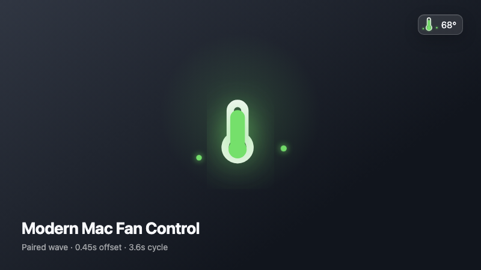
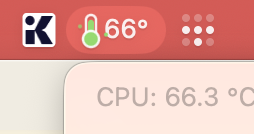
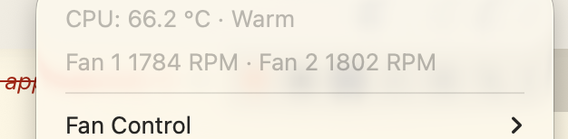

# Modern Mac Fan Control

Native macOS menu-bar temperature monitoring with animated thermal feedback and two guarded fan controllers.

[**Watch the 3.6-second demo →**](docs/thermal-motes.mp4) · [Screenshots ↓](#screenshots)

[](https://www.apple.com/macos/)
[](Package.swift)
[](LICENSE)

<a href="docs/thermal-motes.mp4">
  
</a>

<p align="center"><a href="docs/thermal-motes.mp4">Play the MP4: 800×450 · H.264 · 30 fps</a></p>

## Screenshots

| Screen | What it does |
|---|---|
|  | Shows the animated thermometer and exact temperature together. |
|  | Keeps the menu bar compact while color and mercury level carry the thermal state. |
|  | Reports both fan speeds with native left/right alignment. |

The paired-wave animation sends a left mote followed by a right mote after 0.45 seconds, then repeats every 3.6 seconds. Color moves continuously from healthy green at 45 °C through yellow to danger red at 80 °C.

## Choose one fan controller

**Noise Based** offers three presets:

| Mode | Minimum | Behavior |
|---|---:|---|
| System Default | Apple automatic | Lets macOS control every fan. |
| Quiet | 1,500 RPM | Holds the minimum until the hot threshold, then ramps to maximum at 90 °C. |
| Ultra | Maximum | Runs every fan at 100%. |

Quiet ignores 3 °C cooldown fluctuations and lowers RPM more slowly than it raises it, reducing audible fan hunting. Reaching 90 °C bypasses stabilization and requests maximum speed immediately.

**Target Temperature** offers 40–85 °C in 5 °C steps. The helper checks the CPU every two seconds and raises the existing SMC target by 20 RPM per degree of error, capped at 200 RPM per cycle. A ±0.5 °C deadband holds the current speed; dropping below it immediately requests minimum RPM, while 90 °C always requests maximum speed.

Only one controller can be active. The app starts in Apple automatic mode; after a selection, the helper remains the source of truth for both menu checkmarks and reapplies every manual target after sleep or another SMC reset.

While Target Temperature is active, the app writes `timestamp,target_celsius,actual_celsius` every two seconds to daily CSV files in `~/Library/Logs/ThermalIcon/`. Files whose last sample is older than 72 hours are deleted automatically.

Choose **Temperature Log…** from the main menu to read the retained CSV files in a native window. Fan status rows show only the RPM values.

## Stack at a glance

| Layer | Tech |
|---|---|
| Menu bar UI | AppKit + Core Animation |
| Temperature and fan sensors | IOKit + AppleSMC |
| Fan control | ServiceManagement + signed XPC helper |
| Build and tests | Swift 6 + Swift Package Manager |

## Run locally

```bash
git clone https://github.com/kargnas/modern-mac-fan-control.git
cd modern-mac-fan-control
./script/build_and_run.sh --verify
```

Requires macOS 14 or later and a Developer ID Application or Apple Development signing identity.

When a registered helper already exists, the build script unregisters it before replacing the signed app bundle and registers the new helper afterward.

To enable fan control:

1. Quit other fan controllers.
2. Choose **Fan Control → Enable Fan Control…**.
3. Approve **Thermal Icon.app** in **System Settings → General → Login Items & Extensions**.

The helper accepts only the controls listed above. Quitting the app or losing the helper connection restores Apple automatic control.

## Verify the build

```text
$ swift test
Executed 12 tests, with 0 failures
```

Licensed under [GPL-3.0-only](LICENSE). MIT notices for Stats, smctl, and MacFanControl remain in [THIRD_PARTY_NOTICES.md](THIRD_PARTY_NOTICES.md).
